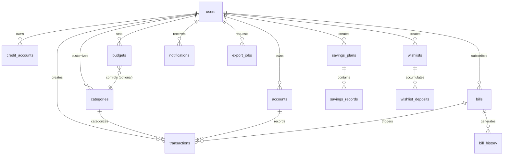

# FloatIsland - 后端数据库设计文档

## 1. 项目概述

**FloatIsland** 是一款现代化的个人财务管理应用，帮助用户记录收支、管理资产、追踪账单、设定储蓄目标和心愿单。本文档详细描述了支撑该应用的后端数据库表结构设计。

### 1.1 核心功能模块

根据前端分析，系统包含以下核心功能：

1. **用户管理** - 用户注册、登录、个人信息管理
2. **交易记录** - 收入/支出记录管理
3. **分类管理** - 收支分类的自定义管理
4. **资产账户** - 银行卡、支付宝、微信等资金账户管理
5. **信用账户** - 信用卡、花呗等负债账户管理
6. **账单订阅** - 定期账单和订阅服务管理
7. **储蓄计划** - 存钱目标和计划管理
8. **心愿单** - 购物目标和储蓄追踪
9. **预算管理** - 月度预算设置和追踪
10. **数据导出** - 账单数据导出功能

---

## 2. 数据库技术选型建议

### 推荐方案

- **主数据库**: PostgreSQL 或 MySQL 8.0+
  - 强大的事务支持
  - 完善的 JSON 字段支持（存储扩展信息）
  - 成熟的生态系统

### 备选方案

- **云数据库**: 
  - AWS RDS (PostgreSQL/MySQL)
  - Google Cloud SQL
  - 阿里云 RDS

---

## 3. 数据库表结构设计

### 3.1 用户相关表

#### 3.1.1 users (用户表)

存储用户基本信息和账户设置。

```sql
CREATE TABLE users (
    id BIGINT PRIMARY KEY AUTO_INCREMENT,
    username VARCHAR(50) UNIQUE NOT NULL COMMENT '用户名',
    email VARCHAR(100) UNIQUE NOT NULL COMMENT '邮箱',
    phone VARCHAR(20) UNIQUE COMMENT '手机号',
    password_hash VARCHAR(255) NOT NULL COMMENT '密码哈希',
    avatar_url VARCHAR(500) COMMENT '头像URL',
    display_name VARCHAR(50) COMMENT '显示昵称',
    verified BOOLEAN DEFAULT FALSE COMMENT '是否实名认证',
    
    -- 设置相关
    currency VARCHAR(10) DEFAULT 'CNY' COMMENT '默认货币单位',
    theme VARCHAR(20) DEFAULT 'light' COMMENT '主题: light/dark',
    language VARCHAR(10) DEFAULT 'zh-CN' COMMENT '语言',
    dark_mode BOOLEAN DEFAULT FALSE COMMENT '深色模式',
    gesture_lock BOOLEAN DEFAULT TRUE COMMENT '手势密码锁定',
    
    -- 统计信息
    continuous_days INT DEFAULT 0 COMMENT '连续记账天数',
    total_records INT DEFAULT 0 COMMENT '总记录数',
    total_badges INT DEFAULT 0 COMMENT '获得徽章数',
    membership_level VARCHAR(20) DEFAULT 'FREE' COMMENT '会员等级: FREE/VIP',
    
    -- 时间戳
    created_at TIMESTAMP DEFAULT CURRENT_TIMESTAMP COMMENT '创建时间',
    updated_at TIMESTAMP DEFAULT CURRENT_TIMESTAMP ON UPDATE CURRENT_TIMESTAMP COMMENT '更新时间',
    last_login_at TIMESTAMP COMMENT '最后登录时间',
    
    INDEX idx_email (email),
    INDEX idx_phone (phone),
    INDEX idx_created_at (created_at)
) ENGINE=InnoDB DEFAULT CHARSET=utf8mb4 COLLATE=utf8mb4_unicode_ci COMMENT='用户表';
```

---

### 3.2 分类管理表

#### 3.2.1 categories (分类表)

存储收支分类信息，支持用户自定义。

```sql
CREATE TABLE categories (
    id BIGINT PRIMARY KEY AUTO_INCREMENT,
    user_id BIGINT NOT NULL COMMENT '用户ID (NULL表示系统默认分类)',
    type ENUM('expense', 'income') NOT NULL COMMENT '分类类型: expense-支出, income-收入',
    name VARCHAR(50) NOT NULL COMMENT '分类名称',
    icon VARCHAR(50) NOT NULL COMMENT '图标代码 (FontAwesome)',
    color VARCHAR(20) NOT NULL COMMENT '颜色标识',
    display_order INT DEFAULT 0 COMMENT '显示排序',
    is_system BOOLEAN DEFAULT FALSE COMMENT '是否系统默认分类',
    is_active BOOLEAN DEFAULT TRUE COMMENT '是否启用',
    
    created_at TIMESTAMP DEFAULT CURRENT_TIMESTAMP,
    updated_at TIMESTAMP DEFAULT CURRENT_TIMESTAMP ON UPDATE CURRENT_TIMESTAMP,
    
    FOREIGN KEY (user_id) REFERENCES users(id) ON DELETE CASCADE,
    INDEX idx_user_type (user_id, type),
    INDEX idx_active (is_active)
) ENGINE=InnoDB DEFAULT CHARSET=utf8mb4 COLLATE=utf8mb4_unicode_ci COMMENT='分类表';
```

---

### 3.3 账户管理表

#### 3.3.1 accounts (资金账户表)

存储用户的各类资金账户（银行卡、支付宝、微信等）。

```sql
CREATE TABLE accounts (
    id BIGINT PRIMARY KEY AUTO_INCREMENT,
    user_id BIGINT NOT NULL COMMENT '用户ID',
    account_type ENUM('bank', 'alipay', 'wechat', 'cash', 'other') NOT NULL COMMENT '账户类型',
    account_name VARCHAR(100) NOT NULL COMMENT '账户名称',
    account_number VARCHAR(50) COMMENT '账号后四位或标识',
    icon VARCHAR(50) COMMENT '图标代码',
    color VARCHAR(20) COMMENT '颜色标识',
    balance DECIMAL(15, 2) DEFAULT 0.00 COMMENT '当前余额',
    initial_balance DECIMAL(15, 2) DEFAULT 0.00 COMMENT '初始余额',
    include_in_total BOOLEAN DEFAULT TRUE COMMENT '是否计入总资产',
    display_order INT DEFAULT 0 COMMENT '显示排序',
    is_active BOOLEAN DEFAULT TRUE COMMENT '是否启用',
    
    created_at TIMESTAMP DEFAULT CURRENT_TIMESTAMP,
    updated_at TIMESTAMP DEFAULT CURRENT_TIMESTAMP ON UPDATE CURRENT_TIMESTAMP,
    
    FOREIGN KEY (user_id) REFERENCES users(id) ON DELETE CASCADE,
    INDEX idx_user_id (user_id),
    INDEX idx_active (is_active)
) ENGINE=InnoDB DEFAULT CHARSET=utf8mb4 COLLATE=utf8mb4_unicode_ci COMMENT='资金账户表';
```

#### 3.3.2 credit_accounts (信用账户表)

存储信用卡、花呗等负债账户。

```sql
CREATE TABLE credit_accounts (
    id BIGINT PRIMARY KEY AUTO_INCREMENT,
    user_id BIGINT NOT NULL COMMENT '用户ID',
    credit_type ENUM('credit_card', 'huabei', 'loan', 'other') NOT NULL COMMENT '信用账户类型',
    account_name VARCHAR(100) NOT NULL COMMENT '账户名称',
    account_number VARCHAR(50) COMMENT '账号后四位',
    icon VARCHAR(50) COMMENT '图标代码',
    color VARCHAR(20) COMMENT '颜色标识',
    credit_limit DECIMAL(15, 2) DEFAULT 0.00 COMMENT '信用额度',
    current_debt DECIMAL(15, 2) DEFAULT 0.00 COMMENT '当前欠款',
    billing_day INT COMMENT '账单日 (1-31)',
    payment_day INT COMMENT '还款日 (1-31)',
    interest_free_days INT DEFAULT 0 COMMENT '免息期天数',
    include_in_total BOOLEAN DEFAULT TRUE COMMENT '是否计入总负债',
    display_order INT DEFAULT 0 COMMENT '显示排序',
    is_active BOOLEAN DEFAULT TRUE COMMENT '是否启用',
    
    created_at TIMESTAMP DEFAULT CURRENT_TIMESTAMP,
    updated_at TIMESTAMP DEFAULT CURRENT_TIMESTAMP ON UPDATE CURRENT_TIMESTAMP,
    
    FOREIGN KEY (user_id) REFERENCES users(id) ON DELETE CASCADE,
    INDEX idx_user_id (user_id),
    INDEX idx_active (is_active)
) ENGINE=InnoDB DEFAULT CHARSET=utf8mb4 COLLATE=utf8mb4_unicode_ci COMMENT='信用账户表';
```

---

### 3.4 交易记录表

#### 3.4.1 transactions (交易记录表)

核心表，存储所有收入和支出记录。

```sql
CREATE TABLE transactions (
    id BIGINT PRIMARY KEY AUTO_INCREMENT,
    user_id BIGINT NOT NULL COMMENT '用户ID',
    type ENUM('expense', 'income', 'transfer') NOT NULL COMMENT '交易类型: expense-支出, income-收入, transfer-转账',
    category_id BIGINT COMMENT '分类ID',
    account_id BIGINT COMMENT '账户ID',
    to_account_id BIGINT COMMENT '转入账户ID (仅转账时使用)',
    
    amount DECIMAL(15, 2) NOT NULL COMMENT '金额',
    currency VARCHAR(10) DEFAULT 'CNY' COMMENT '货币单位',
    
    title VARCHAR(200) COMMENT '标题/商家名称',
    description TEXT COMMENT '备注说明',
    location VARCHAR(200) COMMENT '地点',
    
    transaction_date DATE NOT NULL COMMENT '交易日期',
    transaction_time TIME COMMENT '交易时间',
    
    -- 关联信息
    bill_id BIGINT COMMENT '关联账单ID',
    wishlist_id BIGINT COMMENT '关联心愿单ID',
    
    -- 附加信息
    tags JSON COMMENT '标签数组',
    images JSON COMMENT '图片URL数组',
    
    created_at TIMESTAMP DEFAULT CURRENT_TIMESTAMP,
    updated_at TIMESTAMP DEFAULT CURRENT_TIMESTAMP ON UPDATE CURRENT_TIMESTAMP,
    
    FOREIGN KEY (user_id) REFERENCES users(id) ON DELETE CASCADE,
    FOREIGN KEY (category_id) REFERENCES categories(id) ON DELETE SET NULL,
    FOREIGN KEY (account_id) REFERENCES accounts(id) ON DELETE SET NULL,
    FOREIGN KEY (to_account_id) REFERENCES accounts(id) ON DELETE SET NULL,
    
    INDEX idx_user_date (user_id, transaction_date),
    INDEX idx_user_type (user_id, type),
    INDEX idx_category (category_id),
    INDEX idx_account (account_id),
    INDEX idx_date (transaction_date)
) ENGINE=InnoDB DEFAULT CHARSET=utf8mb4 COLLATE=utf8mb4_unicode_ci COMMENT='交易记录表';
```

---

### 3.5 账单订阅表

#### 3.5.1 bills (账单订阅表)

存储定期账单和订阅服务。

```sql
CREATE TABLE bills (
    id BIGINT PRIMARY KEY AUTO_INCREMENT,
    user_id BIGINT NOT NULL COMMENT '用户ID',
    bill_name VARCHAR(100) NOT NULL COMMENT '账单名称',
    category_id BIGINT COMMENT '分类ID',
    account_id BIGINT COMMENT '支付账户ID',
    
    amount DECIMAL(15, 2) NOT NULL COMMENT '账单金额',
    currency VARCHAR(10) DEFAULT 'CNY' COMMENT '货币单位',
    
    billing_cycle ENUM('daily', 'weekly', 'monthly', 'quarterly', 'yearly') NOT NULL COMMENT '账单周期',
    billing_day INT COMMENT '每月账单日 (1-31)',
    next_billing_date DATE NOT NULL COMMENT '下次扣费日期',
    
    auto_renew BOOLEAN DEFAULT TRUE COMMENT '是否自动续费',
    is_active BOOLEAN DEFAULT TRUE COMMENT '是否启用',
    
    icon VARCHAR(50) COMMENT '图标代码',
    color VARCHAR(20) COMMENT '颜色标识',
    description TEXT COMMENT '备注',
    
    remind_days_before INT DEFAULT 3 COMMENT '提前几天提醒',
    
    created_at TIMESTAMP DEFAULT CURRENT_TIMESTAMP,
    updated_at TIMESTAMP DEFAULT CURRENT_TIMESTAMP ON UPDATE CURRENT_TIMESTAMP,
    
    FOREIGN KEY (user_id) REFERENCES users(id) ON DELETE CASCADE,
    FOREIGN KEY (category_id) REFERENCES categories(id) ON DELETE SET NULL,
    FOREIGN KEY (account_id) REFERENCES accounts(id) ON DELETE SET NULL,
    
    INDEX idx_user_id (user_id),
    INDEX idx_next_billing (next_billing_date),
    INDEX idx_active (is_active)
) ENGINE=InnoDB DEFAULT CHARSET=utf8mb4 COLLATE=utf8mb4_unicode_ci COMMENT='账单订阅表';
```

#### 3.5.2 bill_history (账单历史表)

存储账单的历次扣费记录。

```sql
CREATE TABLE bill_history (
    id BIGINT PRIMARY KEY AUTO_INCREMENT,
    bill_id BIGINT NOT NULL COMMENT '账单ID',
    transaction_id BIGINT COMMENT '关联的交易记录ID',
    
    amount DECIMAL(15, 2) NOT NULL COMMENT '扣费金额',
    billing_date DATE NOT NULL COMMENT '扣费日期',
    status ENUM('pending', 'paid', 'failed', 'cancelled') DEFAULT 'paid' COMMENT '状态',
    
    notes TEXT COMMENT '备注',
    
    created_at TIMESTAMP DEFAULT CURRENT_TIMESTAMP,
    
    FOREIGN KEY (bill_id) REFERENCES bills(id) ON DELETE CASCADE,
    FOREIGN KEY (transaction_id) REFERENCES transactions(id) ON DELETE SET NULL,
    
    INDEX idx_bill_id (bill_id),
    INDEX idx_billing_date (billing_date)
) ENGINE=InnoDB DEFAULT CHARSET=utf8mb4 COLLATE=utf8mb4_unicode_ci COMMENT='账单历史表';
```

---

### 3.6 储蓄计划表

#### 3.6.1 savings_plans (储蓄计划表)

存储用户的存钱计划。

```sql
CREATE TABLE savings_plans (
    id BIGINT PRIMARY KEY AUTO_INCREMENT,
    user_id BIGINT NOT NULL COMMENT '用户ID',
    plan_name VARCHAR(100) NOT NULL COMMENT '计划名称',
    plan_type VARCHAR(50) COMMENT '计划类型: 52周存钱法, 365天存钱法等',
    
    target_amount DECIMAL(15, 2) NOT NULL COMMENT '目标金额',
    current_amount DECIMAL(15, 2) DEFAULT 0.00 COMMENT '当前金额',
    
    start_date DATE NOT NULL COMMENT '开始日期',
    target_date DATE COMMENT '目标日期',
    
    frequency ENUM('daily', 'weekly', 'monthly') COMMENT '存款频率',
    periodic_amount DECIMAL(15, 2) COMMENT '每期存款金额',
    
    account_id BIGINT COMMENT '关联账户ID',
    
    icon VARCHAR(50) COMMENT '图标',
    color VARCHAR(20) COMMENT '颜色',
    description TEXT COMMENT '描述',
    
    status ENUM('active', 'completed', 'paused', 'cancelled') DEFAULT 'active' COMMENT '状态',
    
    created_at TIMESTAMP DEFAULT CURRENT_TIMESTAMP,
    updated_at TIMESTAMP DEFAULT CURRENT_TIMESTAMP ON UPDATE CURRENT_TIMESTAMP,
    completed_at TIMESTAMP COMMENT '完成时间',
    
    FOREIGN KEY (user_id) REFERENCES users(id) ON DELETE CASCADE,
    FOREIGN KEY (account_id) REFERENCES accounts(id) ON DELETE SET NULL,
    
    INDEX idx_user_id (user_id),
    INDEX idx_status (status)
) ENGINE=InnoDB DEFAULT CHARSET=utf8mb4 COLLATE=utf8mb4_unicode_ci COMMENT='储蓄计划表';
```

#### 3.6.2 savings_records (储蓄记录表)

存储储蓄计划的每次存款记录。

```sql
CREATE TABLE savings_records (
    id BIGINT PRIMARY KEY AUTO_INCREMENT,
    plan_id BIGINT NOT NULL COMMENT '计划ID',
    transaction_id BIGINT COMMENT '关联交易记录ID',
    
    amount DECIMAL(15, 2) NOT NULL COMMENT '存入金额',
    deposit_date DATE NOT NULL COMMENT '存入日期',
    period_number INT COMMENT '第几期 (如第32周)',
    
    notes TEXT COMMENT '备注',
    
    created_at TIMESTAMP DEFAULT CURRENT_TIMESTAMP,
    
    FOREIGN KEY (plan_id) REFERENCES savings_plans(id) ON DELETE CASCADE,
    FOREIGN KEY (transaction_id) REFERENCES transactions(id) ON DELETE SET NULL,
    
    INDEX idx_plan_id (plan_id),
    INDEX idx_deposit_date (deposit_date)
) ENGINE=InnoDB DEFAULT CHARSET=utf8mb4 COLLATE=utf8mb4_unicode_ci COMMENT='储蓄记录表';
```

---

### 3.7 心愿单表

#### 3.7.1 wishlists (心愿单表)

存储用户的购物目标和愿望清单。

```sql
CREATE TABLE wishlists (
    id BIGINT PRIMARY KEY AUTO_INCREMENT,
    user_id BIGINT NOT NULL COMMENT '用户ID',
    item_name VARCHAR(200) NOT NULL COMMENT '物品名称',
    
    target_amount DECIMAL(15, 2) NOT NULL COMMENT '目标金额',
    current_amount DECIMAL(15, 2) DEFAULT 0.00 COMMENT '当前已存金额',
    
    icon VARCHAR(100) COMMENT '图标或emoji',
    image_url VARCHAR(500) COMMENT '图片URL',
    
    priority ENUM('low', 'medium', 'high') DEFAULT 'medium' COMMENT '优先级',
    status ENUM('planning', 'in_progress', 'completed', 'cancelled') DEFAULT 'planning' COMMENT '状态',
    
    description TEXT COMMENT '描述说明',
    url VARCHAR(500) COMMENT '商品链接',
    
    target_date DATE COMMENT '期望达成日期',
    
    created_at TIMESTAMP DEFAULT CURRENT_TIMESTAMP,
    updated_at TIMESTAMP DEFAULT CURRENT_TIMESTAMP ON UPDATE CURRENT_TIMESTAMP,
    completed_at TIMESTAMP COMMENT '完成时间',
    
    FOREIGN KEY (user_id) REFERENCES users(id) ON DELETE CASCADE,
    
    INDEX idx_user_id (user_id),
    INDEX idx_status (status)
) ENGINE=InnoDB DEFAULT CHARSET=utf8mb4 COLLATE=utf8mb4_unicode_ci COMMENT='心愿单表';
```

#### 3.7.2 wishlist_deposits (心愿单存款表)

存储为心愿单存入的每笔金额。

```sql
CREATE TABLE wishlist_deposits (
    id BIGINT PRIMARY KEY AUTO_INCREMENT,
    wishlist_id BIGINT NOT NULL COMMENT '心愿单ID',
    transaction_id BIGINT COMMENT '关联交易记录ID',
    
    amount DECIMAL(15, 2) NOT NULL COMMENT '存入金额',
    deposit_date DATE NOT NULL COMMENT '存入日期',
    
    notes TEXT COMMENT '备注',
    
    created_at TIMESTAMP DEFAULT CURRENT_TIMESTAMP,
    
    FOREIGN KEY (wishlist_id) REFERENCES wishlists(id) ON DELETE CASCADE,
    FOREIGN KEY (transaction_id) REFERENCES transactions(id) ON DELETE SET NULL,
    
    INDEX idx_wishlist_id (wishlist_id),
    INDEX idx_deposit_date (deposit_date)
) ENGINE=InnoDB DEFAULT CHARSET=utf8mb4 COLLATE=utf8mb4_unicode_ci COMMENT='心愿单存款表';
```

---

### 3.8 预算管理表

#### 3.8.1 budgets (预算表)

存储用户的月度或自定义周期预算。

```sql
CREATE TABLE budgets (
    id BIGINT PRIMARY KEY AUTO_INCREMENT,
    user_id BIGINT NOT NULL COMMENT '用户ID',
    category_id BIGINT COMMENT '分类ID (NULL表示总预算)',
    
    budget_amount DECIMAL(15, 2) NOT NULL COMMENT '预算金额',
    spent_amount DECIMAL(15, 2) DEFAULT 0.00 COMMENT '已花费金额',
    
    period_type ENUM('monthly', 'weekly', 'custom') DEFAULT 'monthly' COMMENT '预算周期类型',
    start_date DATE NOT NULL COMMENT '开始日期',
    end_date DATE NOT NULL COMMENT '结束日期',
    
    is_active BOOLEAN DEFAULT TRUE COMMENT '是否启用',
    alert_threshold DECIMAL(5, 2) DEFAULT 0.80 COMMENT '预警阈值 (如0.8表示80%)',
    
    created_at TIMESTAMP DEFAULT CURRENT_TIMESTAMP,
    updated_at TIMESTAMP DEFAULT CURRENT_TIMESTAMP ON UPDATE CURRENT_TIMESTAMP,
    
    FOREIGN KEY (user_id) REFERENCES users(id) ON DELETE CASCADE,
    FOREIGN KEY (category_id) REFERENCES categories(id) ON DELETE CASCADE,
    
    INDEX idx_user_period (user_id, start_date, end_date),
    INDEX idx_category (category_id)
) ENGINE=InnoDB DEFAULT CHARSET=utf8mb4 COLLATE=utf8mb4_unicode_ci COMMENT='预算表';
```

---

### 3.9 通知提醒表

#### 3.9.1 notifications (通知表)

存储系统通知和提醒。

```sql
CREATE TABLE notifications (
    id BIGINT PRIMARY KEY AUTO_INCREMENT,
    user_id BIGINT NOT NULL COMMENT '用户ID',
    
    type ENUM('bill_reminder', 'budget_alert', 'goal_achieved', 'system') NOT NULL COMMENT '通知类型',
    title VARCHAR(200) NOT NULL COMMENT '通知标题',
    content TEXT COMMENT '通知内容',
    
    related_type VARCHAR(50) COMMENT '关联类型: bill/budget/wishlist等',
    related_id BIGINT COMMENT '关联对象ID',
    
    is_read BOOLEAN DEFAULT FALSE COMMENT '是否已读',
    priority ENUM('low', 'medium', 'high') DEFAULT 'medium' COMMENT '优先级',
    
    scheduled_at TIMESTAMP COMMENT '计划发送时间',
    sent_at TIMESTAMP COMMENT '实际发送时间',
    read_at TIMESTAMP COMMENT '阅读时间',
    
    created_at TIMESTAMP DEFAULT CURRENT_TIMESTAMP,
    
    FOREIGN KEY (user_id) REFERENCES users(id) ON DELETE CASCADE,
    
    INDEX idx_user_read (user_id, is_read),
    INDEX idx_scheduled (scheduled_at)
) ENGINE=InnoDB DEFAULT CHARSET=utf8mb4 COLLATE=utf8mb4_unicode_ci COMMENT='通知表';
```

---

### 3.10 数据导出表

#### 3.10.1 export_jobs (导出任务表)

存储数据导出请求和状态。

```sql
CREATE TABLE export_jobs (
    id BIGINT PRIMARY KEY AUTO_INCREMENT,
    user_id BIGINT NOT NULL COMMENT '用户ID',
    
    export_type ENUM('excel', 'pdf', 'csv') NOT NULL COMMENT '导出格式',
    start_date DATE NOT NULL COMMENT '数据开始日期',
    end_date DATE NOT NULL COMMENT '数据结束日期',
    
    filters JSON COMMENT '筛选条件',
    
    status ENUM('pending', 'processing', 'completed', 'failed') DEFAULT 'pending' COMMENT '状态',
    file_url VARCHAR(500) COMMENT '文件下载URL',
    file_size BIGINT COMMENT '文件大小(字节)',
    
    email VARCHAR(100) COMMENT '接收邮箱',
    sent_email BOOLEAN DEFAULT FALSE COMMENT '是否已发送邮件',
    
    error_message TEXT COMMENT '错误信息',
    
    created_at TIMESTAMP DEFAULT CURRENT_TIMESTAMP,
    completed_at TIMESTAMP COMMENT '完成时间',
    expires_at TIMESTAMP COMMENT '文件过期时间',
    
    FOREIGN KEY (user_id) REFERENCES users(id) ON DELETE CASCADE,
    
    INDEX idx_user_id (user_id),
    INDEX idx_status (status),
    INDEX idx_created_at (created_at)
) ENGINE=InnoDB DEFAULT CHARSET=utf8mb4 COLLATE=utf8mb4_unicode_ci COMMENT='导出任务表';
```

---

### 3.11 系统配置表

#### 3.11.1 system_categories (系统默认分类表)

存储系统预设的分类模板。

```sql
CREATE TABLE system_categories (
    id BIGINT PRIMARY KEY AUTO_INCREMENT,
    type ENUM('expense', 'income') NOT NULL COMMENT '分类类型',
    name VARCHAR(50) NOT NULL COMMENT '分类名称',
    icon VARCHAR(50) NOT NULL COMMENT '图标代码',
    color VARCHAR(20) NOT NULL COMMENT '颜色',
    display_order INT DEFAULT 0 COMMENT '显示顺序',
    is_active BOOLEAN DEFAULT TRUE COMMENT '是否启用',
    
    created_at TIMESTAMP DEFAULT CURRENT_TIMESTAMP,
    updated_at TIMESTAMP DEFAULT CURRENT_TIMESTAMP ON UPDATE CURRENT_TIMESTAMP,
    
    INDEX idx_type (type)
) ENGINE=InnoDB DEFAULT CHARSET=utf8mb4 COLLATE=utf8mb4_unicode_ci COMMENT='系统默认分类表';
```

---

## 4. 数据库索引策略

### 4.1 核心索引

1. **用户ID索引**: 所有关联用户的表都建立 `user_id` 索引
2. **日期索引**: 交易记录表的 `transaction_date` 和复合索引 `(user_id, transaction_date)`
3. **状态索引**: 各类状态字段建立索引以支持筛选查询
4. **外键索引**: 所有外键字段自动建立索引

### 4.2 复合索引

```sql
-- 交易记录查询优化
INDEX idx_user_date_type (user_id, transaction_date, type)

-- 预算查询优化
INDEX idx_user_period (user_id, start_date, end_date)

-- 账单提醒查询优化
INDEX idx_next_billing_active (next_billing_date, is_active)
```

---

## 5. 数据安全与隐私

### 5.1 敏感数据处理

| 字段 | 处理方式 |
|------|---------|
| 密码 | BCrypt/Argon2 哈希 + Salt |
| 账户号码 | 只存储后4位或加密存储 |
| 用户邮箱/手机 | 脱敏显示 |
| 交易金额 | 权限控制访问 |

### 5.2 数据备份策略

- **全量备份**: 每日凌晨进行
- **增量备份**: 每6小时一次
- **异地备份**: 跨区域冗余存储
- **备份保留**: 至少30天

---

## 6. 性能优化建议

### 6.1 分表策略

当数据量增长到一定规模时，建议对以下表进行分表：

1. **transactions** - 按年份或用户ID范围分表
2. **notifications** - 按月份分表
3. **bill_history** - 按年份分表

### 6.2 缓存策略

使用 Redis 缓存以下数据：

- 用户基本信息 (TTL: 1小时)
- 账户余额统计 (TTL: 5分钟)
- 月度统计数据 (TTL: 30分钟)
- 分类列表 (TTL: 1天)

### 6.3 查询优化

```sql
-- 避免全表扫描，使用分页查询
SELECT * FROM transactions 
WHERE user_id = ? 
ORDER BY transaction_date DESC 
LIMIT 20 OFFSET 0;

-- 使用覆盖索引提升性能
SELECT id, amount, transaction_date 
FROM transactions 
WHERE user_id = ? AND transaction_date >= ?;
```

---

## 7. 数据迁移与版本管理

### 7.1 版本控制

使用数据库迁移工具管理表结构变更：

- **推荐工具**: Flyway, Liquibase, 或框架自带的 Migration 工具
- **命名规范**: `V{版本号}__{描述}.sql` (如 `V1__create_users_table.sql`)

### 7.2 初始化数据

```sql
-- 插入系统默认分类
INSERT INTO system_categories (type, name, icon, color, display_order) VALUES
('expense', '餐饮美食', 'fa-utensils', 'orange', 1),
('expense', '购物消费', 'fa-bag-shopping', 'purple', 2),
('expense', '交通出行', 'fa-bus', 'blue', 3),
('expense', '住房物业', 'fa-house', 'green', 4),
('income', '工资薪水', 'fa-sack-dollar', 'indigo', 1),
('income', '理财收益', 'fa-arrow-trend-up', 'red', 2),
('income', '兼职外快', 'fa-briefcase', 'green', 3),
('income', '礼金红包', 'fa-gift', 'pink', 4);
```

---

## 8. API 数据视图建议

为前端提供便捷的数据查询视图：

### 8.1 用户资产概览视图

```sql
CREATE VIEW user_asset_overview AS
SELECT 
    u.id as user_id,
    COALESCE(SUM(a.balance), 0) as total_assets,
    COALESCE(SUM(c.current_debt), 0) as total_debt,
    COALESCE(SUM(a.balance), 0) - COALESCE(SUM(c.current_debt), 0) as net_worth
FROM users u
LEFT JOIN accounts a ON u.id = a.user_id AND a.is_active = TRUE AND a.include_in_total = TRUE
LEFT JOIN credit_accounts c ON u.id = c.user_id AND c.is_active = TRUE AND c.include_in_total = TRUE
GROUP BY u.id;
```

### 8.2 月度收支统计视图

```sql
CREATE VIEW monthly_income_expense AS
SELECT 
    user_id,
    DATE_FORMAT(transaction_date, '%Y-%m') as month,
    SUM(CASE WHEN type = 'income' THEN amount ELSE 0 END) as total_income,
    SUM(CASE WHEN type = 'expense' THEN amount ELSE 0 END) as total_expense,
    SUM(CASE WHEN type = 'income' THEN amount ELSE -amount END) as net_amount
FROM transactions
GROUP BY user_id, DATE_FORMAT(transaction_date, '%Y-%m');
```

---

## 9. ER 关系图



---

## 10. 扩展功能建议

### 10.1 未来可能增加的表

1. **tags** (标签表) - 支持交易标签化管理
2. **attachments** (附件表) - 存储发票、收据图片
3. **recurring_templates** (循环模板表) - 定期交易模板
4. **shared_accounts** (共享账本表) - 支持家庭/情侣共享记账
5. **achievements** (成就徽章表) - 游戏化激励系统

### 10.2 数据分析表

1. **daily_stats** (每日统计表) - 预聚合统计数据
2. **category_trends** (分类趋势表) - 长期趋势分析
3. **user_behaviors** (用户行为表) - 用户习惯分析

---

## 11. 总结

本数据库设计文档涵盖了 FloatIsland 应用的核心功能需求，包括：

✅ **用户管理** - 完整的用户信息和设置  
✅ **交易记录** - 灵活的收支记录系统  
✅ **账户管理** - 多账户和信用账户支持  
✅ **账单订阅** - 定期账单追踪  
✅ **储蓄计划** - 目标导向的存钱功能  
✅ **心愿单** - 购物目标管理  
✅ **预算控制** - 智能预算提醒  
✅ **数据导出** - 完整的数据导出功能  

### 设计亮点

- 📊 **可扩展性**: 支持未来功能扩展
- 🔒 **安全性**: 完善的数据安全措施
- ⚡ **性能**: 优化的索引和查询设计
- 🎯 **灵活性**: 支持用户自定义和系统默认配置
- 📈 **分析友好**: 便于数据统计和分析

---

**文档版本**: v1.0  
**创建日期**: 2025-12-04  
**最后更新**: 2025-12-04
